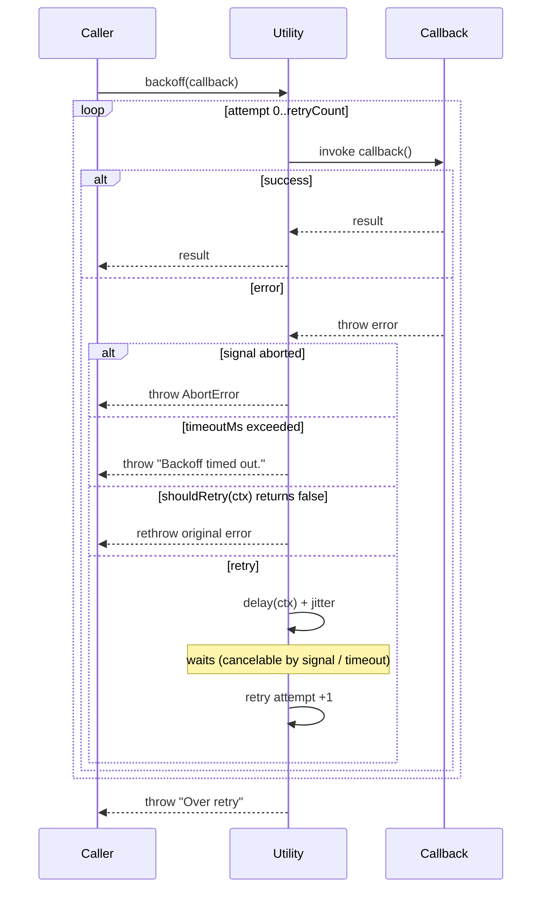

# Architecture

## Overview

`@aecomet/backoff-util` is a zero-dependency TypeScript utility library that provides configurable retry logic with backoff for any async function. It is distributed as both ESM and CJS modules.

## Tech Stack

| Category       | Tool / Library         | Version |
| -------------- | ---------------------- | ------- |
| Language       | TypeScript             | ^7.x    |
| Build          | tsdown (rolldown)      | ^0.22.x |
| Test           | Vitest                 | ^4.x    |
| Package manager| pnpm                   | 11      |
| CI             | GitHub Actions         | —       |
| Lint (commit)  | commitlint (Docker)    | —       |

## Directory Structure

```
backoff-util/
├── src/                        # Library source
│   ├── index.ts                # Public API entry point
│   ├── types.ts                # Shared type definitions
│   ├── delay.ts                # Delay function factories (exponential / linear / fixed)
│   ├── jitter.ts               # Jitter function factories (full / none)
│   └── utility.ts              # Utility class (DI container + backoff loop)
├── __tests__/
│   ├── unit/
│   │   ├── delay.test.ts       # Delay function unit tests
│   │   └── jitter.test.ts      # Jitter function unit tests
│   ├── integration/
│   │   └── utility.test.ts     # Utility integration tests
│   ├── vitest.config.mts       # Vitest configuration
│   └── tsconfig.json           # TypeScript config for tests
├── example/                    # Usage examples
│   ├── sample.mjs              # Default config example
│   ├── sampleWithConfig.mjs    # Custom config example
│   ├── sampleWithAxios.mjs     # HTTP retry example (axios)
│   ├── sampleWithShouldRetry.mjs
│   ├── sampleWithOnRetry.mjs
│   ├── sampleWithTimeout.mjs
│   ├── sampleWithStrategy.mjs
│   ├── sampleWithAbort.mjs
│   └── html/                   # Browser example (Vite dev server)
├── dist/                       # Build output (generated)
│   ├── index.mjs               # ESM bundle
│   ├── index.cjs               # CJS bundle
│   ├── index.d.mts             # ESM type declarations
│   └── index.d.cts             # CJS type declarations
├── docs/
│   └── architecture.md         # This file
├── .github/
│   ├── copilot-instructions.md
│   ├── dependabot.yml
│   └── workflows/
│       ├── test-runner.yml     # Runs tests on pull requests
│       └── lint-runner.yml     # Runs commitlint on pull requests
├── tsdown.config.ts            # tsdown library build configuration
├── tsconfig.json               # Root TypeScript configuration
├── .oxfmtrc.json               # oxfmt formatting rules
├── pnpm-lock.yaml
└── package.json
```

## Core Types

### `BackoffOptions`

Configuration interface passed to the `Utility` constructor. All properties are optional.

| Option        | Type                                           | Default          |
| ------------- | ---------------------------------------------- | ---------------- |
| `retryCount`  | `number`                                       | `10`             |
| `minDelay`    | `number`                                       | `10`             |
| `maxDelay`    | `number`                                       | `1000`           |
| `delay`       | `DelayFn \| 'exponential' \| 'linear' \| 'fixed'` | `'exponential'` |
| `factor`      | `number`                                       | `2`              |
| `jitter`      | `JitterFn \| 'full' \| 'none'`                  | `'full'`         |
| `shouldRetry` | `(ctx: BackoffContext) => boolean`             | retry always     |
| `onRetry`     | `(ctx: BackoffContext) => void`                | `console.warn`   |
| `timeoutMs`   | `number`                                       | none             |
| `signal`      | `AbortSignal`                                  | none             |

### `BackoffContext`

| Field     | Type      | Description                              |
| --------- | --------- | ---------------------------------------- |
| `attempt` | `number`  | Current attempt index (0-based)          |
| `error`   | `unknown` | The error that caused the retry          |
| `elapsed` | `number`  | Total elapsed time since the first call (ms) |
| `remaining` | `number`  | Number of retries left (including current) |
| `nextDelay` | `number` \| `undefined` | Next wait time in ms (undefined on final attempt) |

### `DelayFn`

```ts
type DelayFn = (ctx: BackoffContext) => number;
```

Returns the raw delay in ms for a given attempt context. Built-in strategies:

| Strategy      | Formula                                         |
| ------------- | ----------------------------------------------- |
| `exponential` | `min(minDelay * factor^attempt, maxDelay)`      |
| `linear`      | `min(minDelay * (attempt + 1), maxDelay)`       |
| `fixed`       | `minDelay`                                      |

### `JitterFn`

```ts
type JitterFn = (delay: number) => number;
```

Takes the raw delay and returns a jittered delay. Built-in strategies:

| Strategy | Behavior                                                    |
| -------- | ----------------------------------------------------------- |
| `full`   | Returns a random value in `[0, delay)` to spread retry timing |
| `none`   | Returns `delay` unchanged                                   |
| `decorrelated` | Returns a random value in `[minDelay, min(delay, prevDelay * factor))` — grows aggressively at first, then stabilizes |

## Core Classes

### `Utility`

The main class. Accepts `BackoffOptions` in its public constructor; you own the instance lifecycle.

| Method                    | Description                                       |
| ------------------------- | ------------------------------------------------- |
| `constructor(options)`    | Creates an instance and normalizes delay/jitter    |
| `backoff<T>(callback)`    | Executes the callback with the configured backoff |

Construction diagram:

```
BackoffOptions
  ├── delay string ──► normalizeDelay() ──► DelayFn (cached)
  ├── delay function ──────────────────────► DelayFn (passthrough)
  ├── jitter string ──► normalizeJitter() ──► JitterFn (cached)
  └── jitter function ──────────────────────► JitterFn (passthrough)
```

Normalization happens once at construction time, so the hot path (the retry loop) has zero branching.

## Backoff Algorithm

The `backoff` method executes the following loop:

```
for attempt = 0; attempt <= retryCount; attempt++:
  1. check signal.aborted → throw BackoffAbortError
  2. try callback → return on success
  3. check signal.aborted → throw BackoffAbortError
  4. check timeoutMs → throw BackoffTimeoutError if exceeded
  5. check shouldRetry(ctx) → rethrow if returns false
  6. if attempt < retryCount: nextDelay = jitter(delay(ctx))
  7. await onRetry(ctx) with nextDelay if provided
  8. if attempt == retryCount → break (no delay after the final failure)
  9. sleep(nextDelay ms), aborted by signal / timeout during sleep
throw BackoffError("Over retry", { cause: lastError })
```

## Retry Flow (Sequence Diagram)

The following sequence diagram illustrates the retry behavior of `backoff`:



## Build Output

tsdown is configured in `tsdown.config.ts` and emits ESM + CJS bundles with type declarations.

| File                  | Format | Usage                  |
| --------------------- | ------ | ---------------------- |
| `dist/index.mjs`      | ESM    | `import` (bundlers)    |
| `dist/index.cjs`      | CJS    | `require` (CommonJS)   |
| `dist/index.d.mts`    | ESM    | TypeScript types       |
| `dist/index.d.cts`    | CJS    | TypeScript types       |

## CI / CD

Both workflows are triggered on pull requests.

- **test-runner.yml** — installs dependencies and runs `pnpm test` on `ubuntu-latest`.
- **lint-runner.yml** — runs commitlint inside a pre-built Docker image (`ghcr.io/aecomet/commitlint-base`) to validate commit messages against the Conventional Commits specification.
